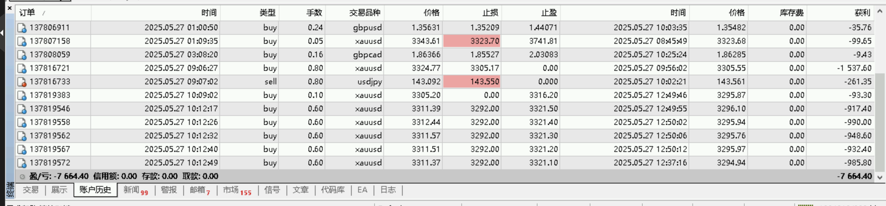

### 2025-05-27日亏损8000美金买到的教训
黄金原本是ea自动交易的，只因为手动开单导致亏损3000美金，后又想着赚回来继续手动开仓导致又继续亏损5000美金。
用8000美金买的第一点教训：  
- 人在看到行情波动的时候总是有很多想法。如何避免下次因为看到行情，产生各种各样想法导致继续犯相同的错误？  
远离市场这一点非常重要！  
追求其他乐趣！  
- 交易变化莫测，如何以不变的规律应对万变的市场。从而长期稳定获利？  
道是不变的，道是规则，包括止损规则、入场规则；道是规律，趋势规律、周期规律；道是风控，只有存活下来才是王者。  
  </img>