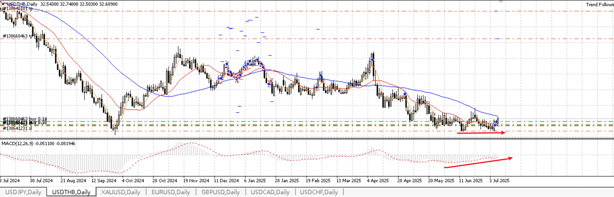
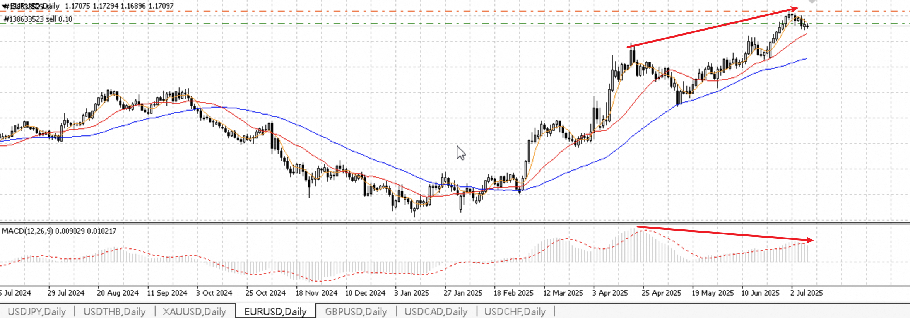
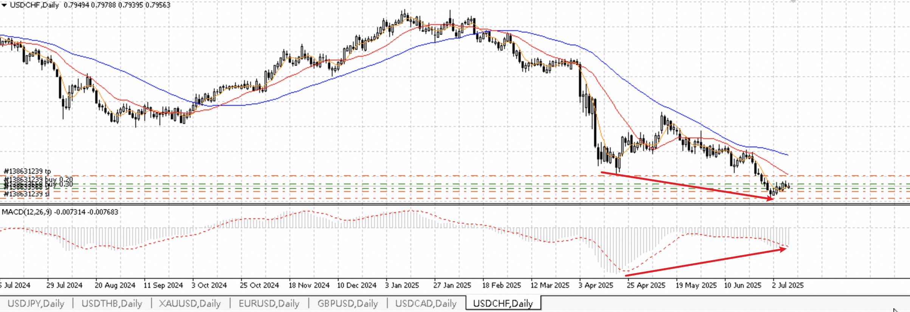

#### 2025年07月08日交易记录
分析：usdthb经历一轮下跌后震荡下行macd背离形成双重底，符合第一类买点。在靠近低点附近买入1%风险仓（-60美金）。
若再次跌近双底附近则持仓不动。若上涨，则在第一次回调企稳后加仓1%风险仓，止损设置在企稳点下方。  
</img>

分析：eurusd经历一轮上涨后出现macd背离，符合第一类卖点。在靠近高点附近入1%风险仓，止损在高点上方。
观察MA20均线附近支撑情况，若企稳继续突破高点则止损。若继续下跌，则持仓不动，且在第一次反弹至压力位置视情况加1%风险仓。  
</img>

分析：usdchf经历一轮大幅下跌后macd大幅背离，符合第一类买点。在低位企稳位置附近入1%风险仓，若再次触底则止损。
若继续上涨则持仓不动，直到第一次回调企稳再次加1%风险仓，止损设置在企稳点下方。  
</img>