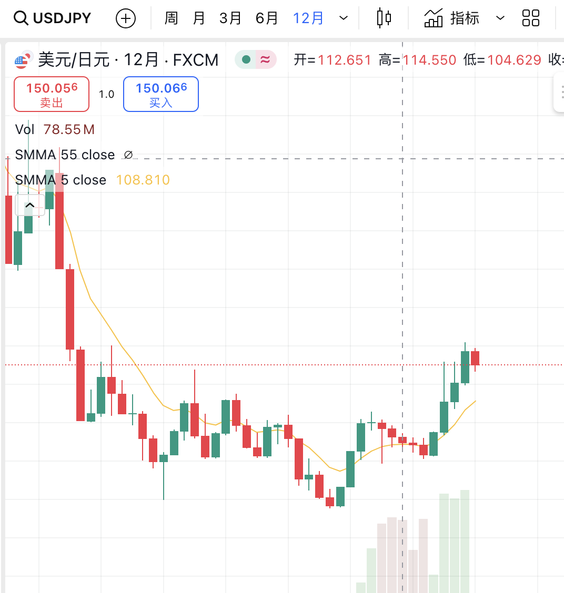
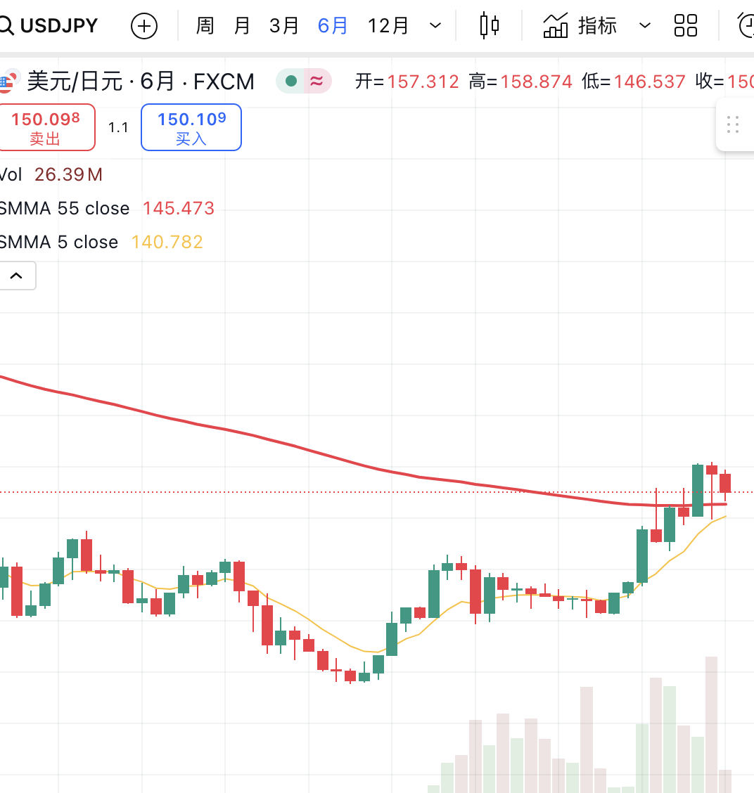
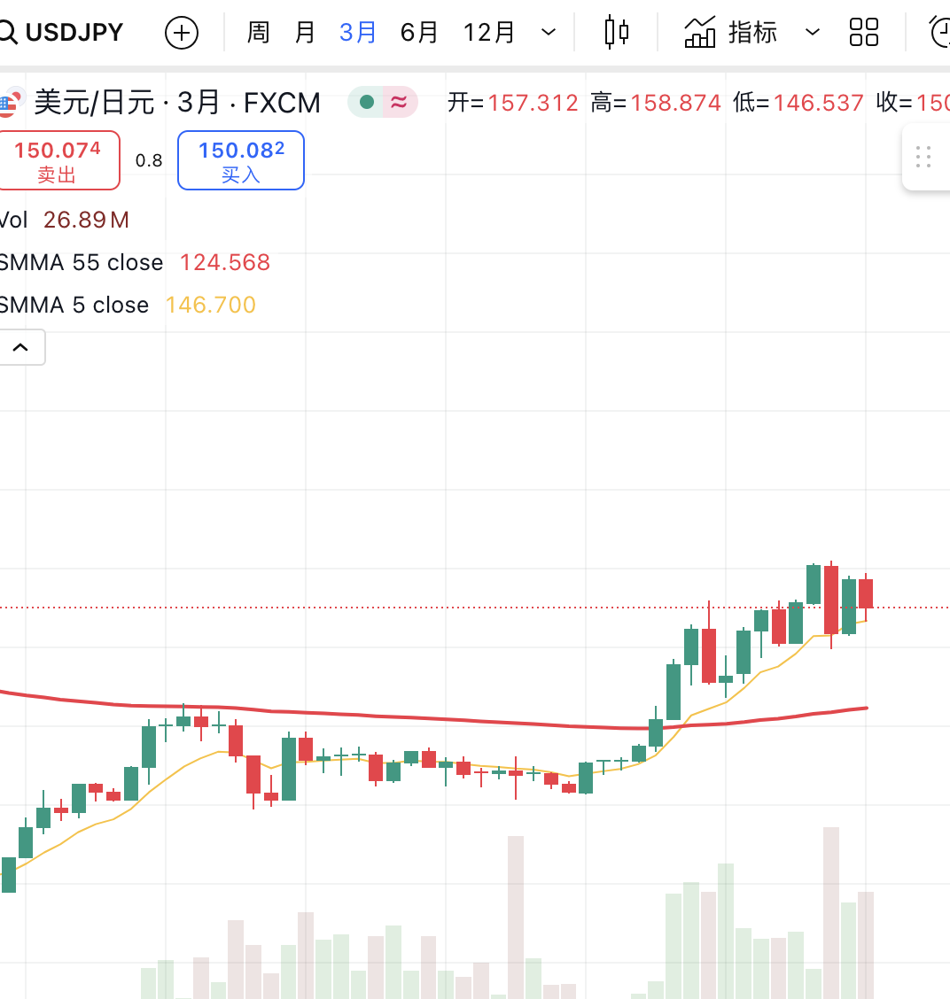
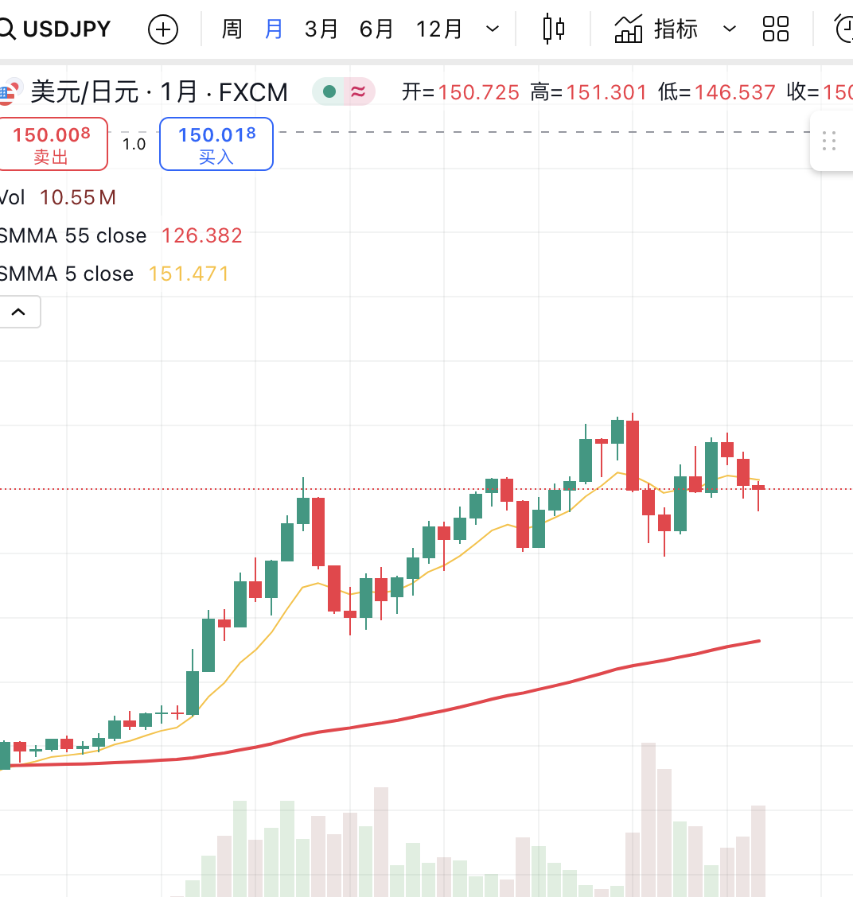
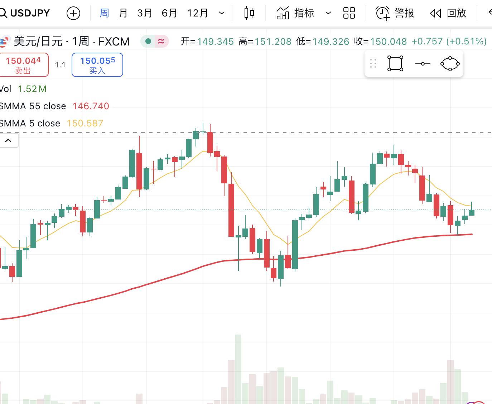
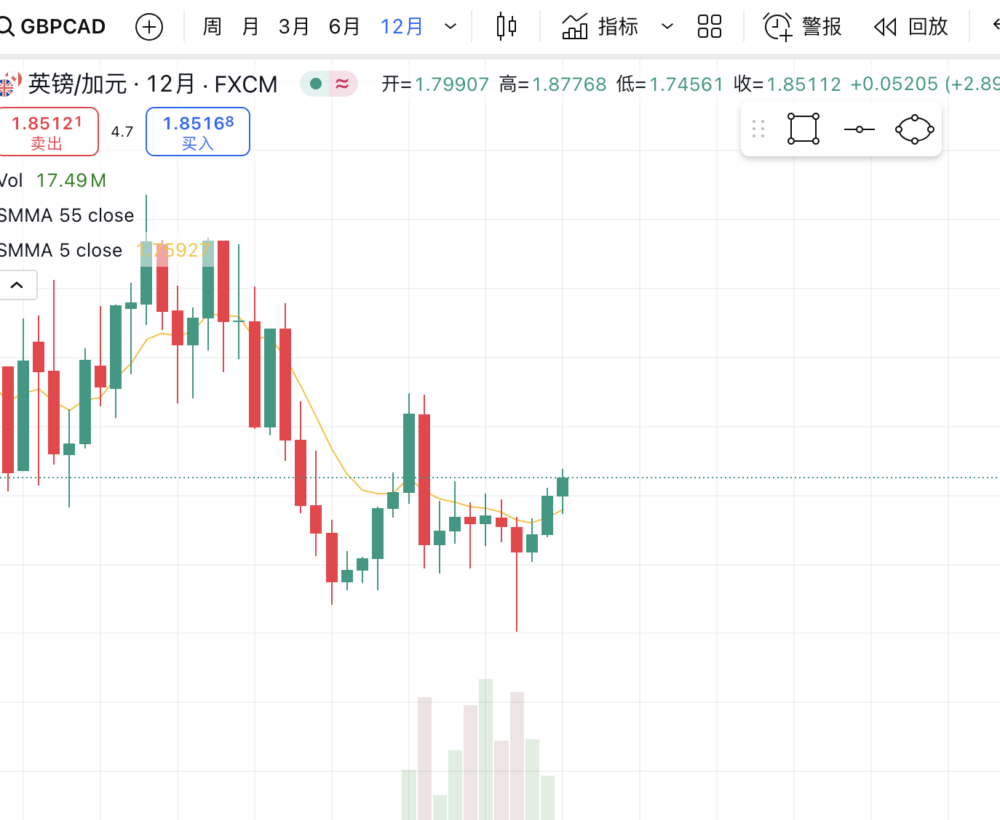
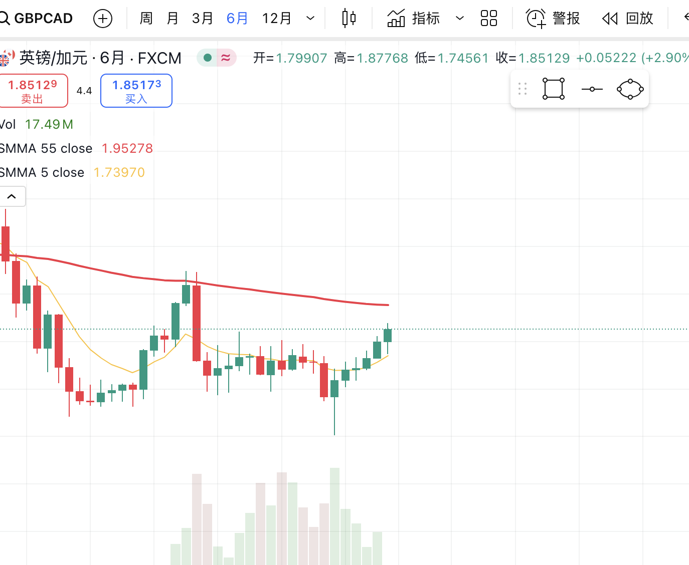
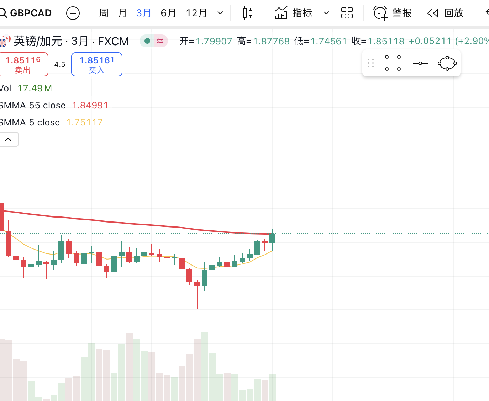
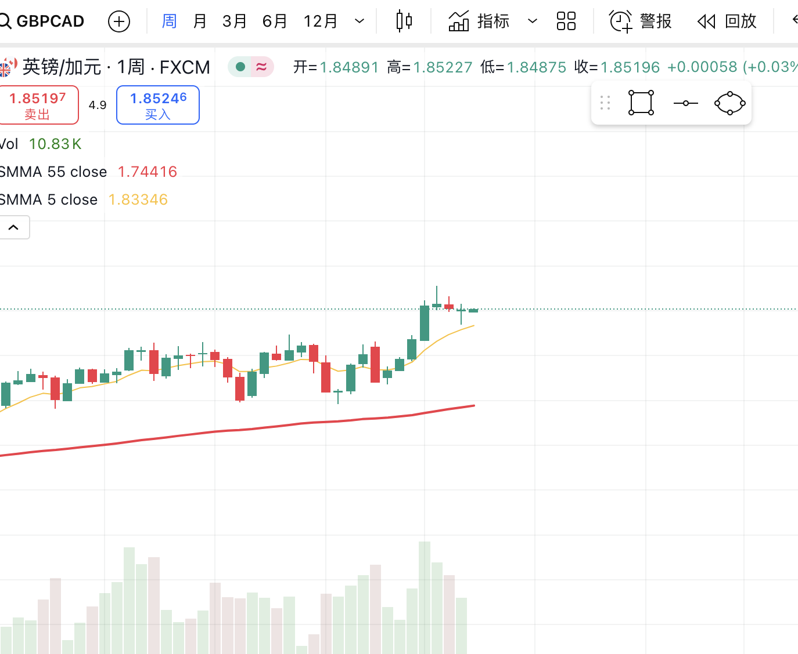

### USDJPY-2025-03-29日趋势评估
年线在5日均线上方，显示出强趋势  
</img>   
半年线在5日均线上方，显示出强趋势，且呈现出突破长期半年线势头 
</img>  
季线在5日均线上方，显示出强趋势  
</img>  
月线刚刚跌破5日均线，且3月K显示出支撑形态，可能延续季线趋势 
</img>  
周线在5日均线下方，回踩到长期周线且呈现支撑形态，可能延续季线的趋势 
</img>  

### GBPCAD-2025-03-31日趋势评估
年线在5日均线上方，显示出强趋势  
</img>  
半年线在5日均线上方，显示出强趋势，且呈现出趋势反转形态 
</img>  
季线在5日均线上方，显示出强趋势  
</img>  
月线在5日均线上方，显示出强趋势 
</img>  
周线在5日均线上方，显示出强趋势
</img>  
