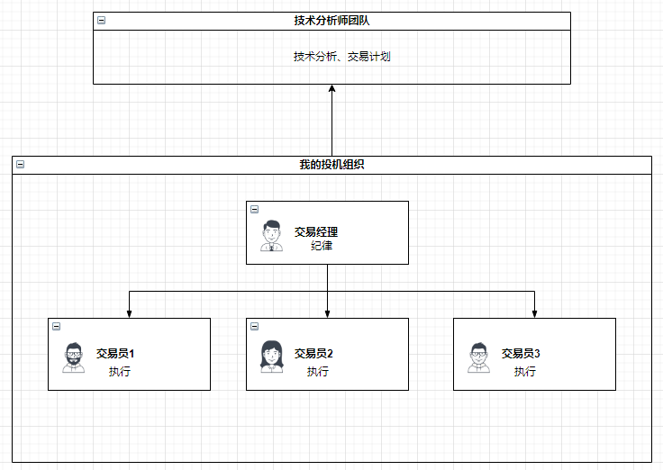

<h4>外汇市场</h4>
<h5>外汇市场的参与者</h5>
外汇市场的参与者主要包括各国的中央银行、商业银行、非银行金融机构、经纪商、自营商及大型跨国企业等。外汇交易的参与者，按其交易的目的，可以划分为投资者和投机者两类。  
<h5>投机</h5>
在外汇市场的投机者，包括了各国的中央银行、商业银行、非银行机构、经纪商、自营商及大型跨国企业。其中少部分以组织的形式存在，大部分是个人投机者。 
以组织形式的投机者，他们拥有顶级分析师，他们拥有优秀的交易系统，他们拥有可靠且广泛的消息来源，他们拥有庞大的资金优势，他们拥有严格的纪律。
个人投机者，他们与组织形式的投机者相比，所掌握的资源匮乏，他们的知识、见识、纪律、资金等各个方面都存在着巨大劣势。 
<h5>对投机的思考</h5>
要在外汇市场中生存，就必须建立自己的优势。如何建立优势？那就是建立自己的交易组织，这个组织有着严格的纪律，且依靠外部优秀的技术分析师团队。 
</img>

