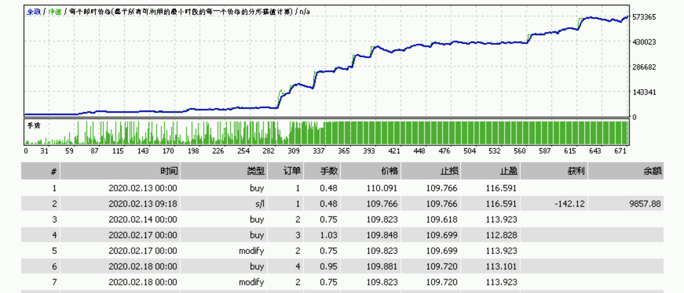

#### TrendFolowing的特点
TrendFollowing利用趋势跟踪策略，当存在趋势时，效果非常显著。趋势越强，趋势周期越长，效果越好。但在震荡行情中表现不佳。 

#### XAUUSD合约趋势特点分析
XAU/USD，即黄金兑美元，是全球最重要的贵金属交易品种之一，具有避险属性、美元关联性、通胀对冲、利率敏感性等特征。  
- 避险属性：金融市场动荡时黄金上涨。  
  - 地缘政治风险（战争、制裁、地区冲突等）  
当发生战争、政治不稳定、贸易争端等，市场风险偏好下降，黄金作为避险资产通常上涨。  
  - 全球经济不确定性  
经济衰退、债务危机、股市暴跌时，投资者倾向于买入黄金，推动XAU/USD上涨。  
例子：2022年俄乌冲突爆发后，XAU/USD迅速上涨至2000美元以上。  
- 总结  
黄金避险属性明显，在经济不确定或全球动荡时期有着较强趋势，适合趋势跟踪。在全球风险偏好回升时期趋势较弱，不建议开启策略。  

XAUUSD在2018-2024年的测试表现：  
</img>

#### USDJPY美元日元合约趋势特点分析
USD/JPY 是全球交易量最大的货币对之一，受日本政治、经济、利率政策、全球市场避险情绪等多重因素影响。  
- 与全球市场风险偏好高度相关  
  - 日元是全球避险货币之一  
当市场避险情绪上升（股市暴跌、金融危机、战争等），日元通常升值（USD/JPY下跌）。  
当市场风险偏好回升，投资者追逐高收益资产，日元贬值（USD/JPY上涨）。
- 日本央行（BoJ）政策对USD/JPY影响巨大  
  - 超低利率政策（长期宽松）  
日本长期维持接近 0% 的利率，甚至实施负利率政策，导致日元成为全球主要融资货币（套息交易）。  
  - 利率差交易（Carry Trade）  
日本利率低，而美联储利率较高，投资者借入日元，换成美元投资高收益资产，推动 USD/JPY 上升。  
当美联储加息，美元吸引力增加，USD/JPY 通常上涨；如果美联储降息，利差缩小，USD/JPY 可能下跌。
- 与日本经济状况相关
  - 日本出口导向型经济
日元贬值有利于日本出口企业（如丰田、索尼、本田等），政府通常希望保持日元相对较弱，以提升出口竞争力。  
若日元过度升值，日本政府或央行可能干预外汇市场，影响USD/JPY走势。  
  - 经济增长疲软，通胀长期低迷  
日本长期面临低增长和低通胀，政府和央行依赖宽松政策刺激经济，压制日元升值。  
但如果通胀意外走高（如能源价格飙升），可能推动市场预期日本央行收紧货币政策，利好日元（USD/JPY下跌）  
- 总结  
受到政治经济影响，USDJPY有着长期趋势，适合趋势跟踪策略。  

USDJPY在2020-2024年的测试表现：  
</img>

#### USDTHB美元泰铢合约趋势特点分析
- 政治不稳定性：泰国近年来政局动荡较多，包括政党更替、军方干预、街头抗议等，这通常会影响泰铢的市场信心，导致泰铢贬值，推高USD/THB
- 旅游业的重要性：泰国是全球著名旅游国家，旅游收入占GDP的10%以上。疫情期间泰铢贬值，但旅游复苏后，泰铢往往会升值（USD/THB下跌）
- 外资流动：泰国的股市和债市吸引不少外资，若全球经济形势不好，外资撤出泰国，泰铢可能走弱（USD/THB上升）  
- 总结：USDTHB有比较好的周期性趋势，非常适合趋势跟踪策略。    

USDTHB在2018-2024年的测试表现：
</img>
